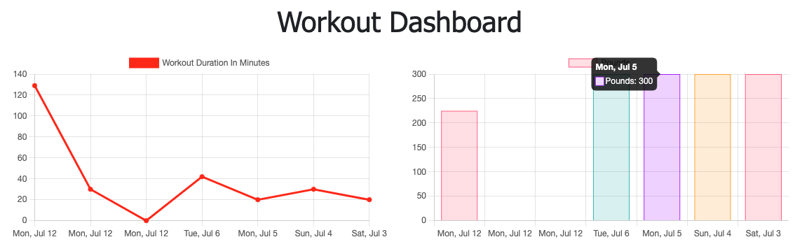

# Tech-Blog

# Table of Contents

- [Description](#description)
- [Installation](#installation)
- [Usage](#usage)
- [Contributing](#contributing)
- [Test](#test)
- [License](#license)
- [Issues](#issues)
- [Questions](#questions)

## Description:

This app was made with HTML, CSS, JavaScript, MongoDB, Mongoose, Express, and Node.js.

[Link to Deployed App](https://salty-everglades-49858.herokuapp.com/)

## Installation:
n/a

## Usage:
Used to track the fitness activity of the user and display recent results for the past 7 days in graphical format on the dashboard page. Designed for those looking for motivation to keep going with their fitness routine.

## Contributing:
Please submit a pull request.  For large changes please email me first.

## Test: 
n/a

## License:
For more information about the License, click on the link below.

## Issues:
N/A

- [License](https://opensource.org/licenses/ISC)

##  Questions:
For questions about the app you can go to my 
Github page at the following link:

- [Github Profile](https://github.com/abalcs)

For additional questions please reach out to me via email at: abalcom23@gmail.com.